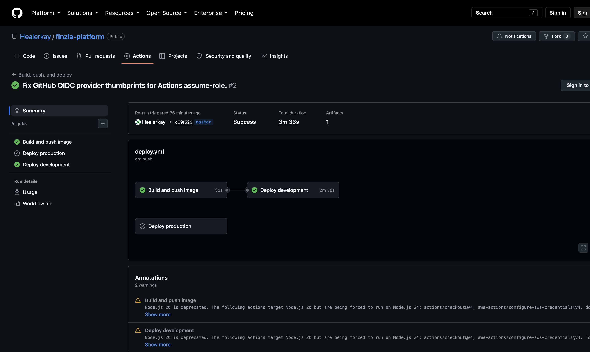
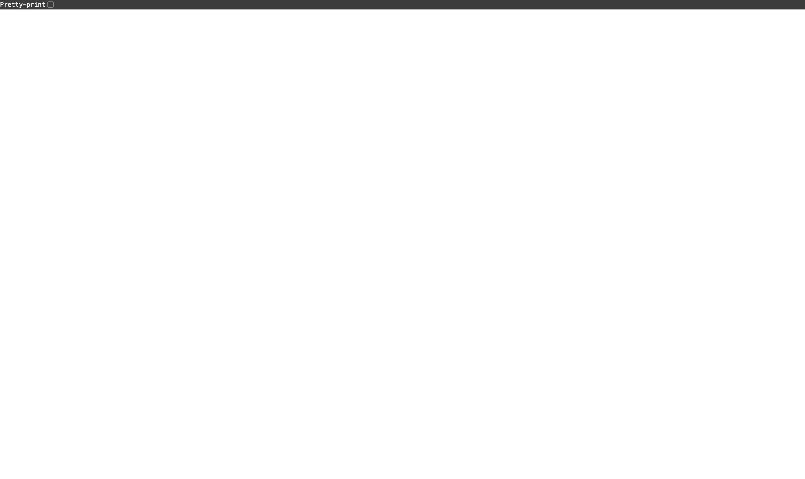
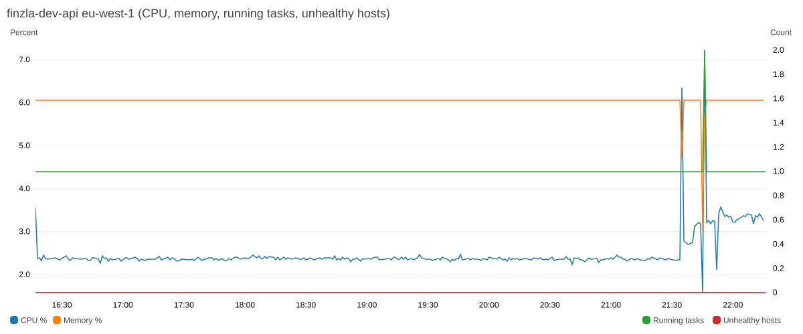
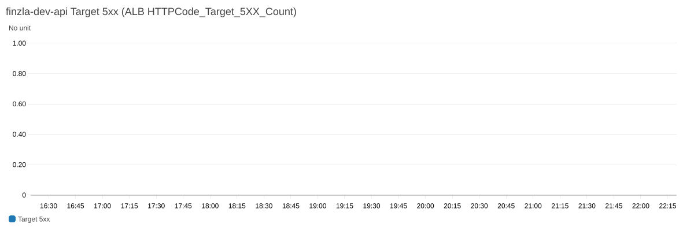
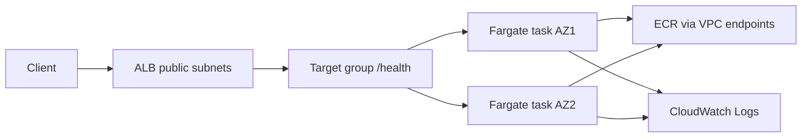

# Finzla Cloud & Platform Engineer – technical assessment

Personal repository for the Finzla Cloud & Platform Engineer assessment. The **README is the written submission**. Everything the brief asks to explain is in this file; there is no separate Word/PDF attachment.

**The AWS demo was taken down after evidence was captured**, so Finzla is not waiting on a live URL and I am not leaving an ALB/Fargate/VPC-endpoint bill running. Recreate with Terraform in `terraform/` if a reviewer wants a live environment.

Captured **dev** environment (eu-west-1, account `840432317209`):

- Health (while live): `http://finzla-dev-alb-1168961660.eu-west-1.elb.amazonaws.com/health`
- Version (while live): `http://finzla-dev-alb-1168961660.eu-west-1.elb.amazonaws.com/version`
- CloudWatch dashboard (while live): `finzla-dev-api`
- GitHub (still live): https://github.com/Healerkay/finzla-platform
- Actions run (still live): https://github.com/Healerkay/finzla-platform/actions/runs/34061066470

Use the screenshots below plus GitHub Actions history as proof the stack ran. Dev was **HTTP only**; HTTPS is in Terraform for production.

### Evidence screenshots

1. **Load balancer health** – the running container answers `GET /health` through the public ALB.  
2. **GitHub Actions deploy** – OIDC build, push to ECR, ECS deploy, and health check succeeded (production job skipped by design).  
3. **Running image version** – `/version` returns the Git SHA baked into the image, so this is not a local mock.  
4. **CloudWatch** – dashboard metrics for `finzla-dev-api` (CPU, memory, running tasks, unhealthy hosts) in eu-west-1.  
5. **CloudWatch Target 5xx** – ALB `HTTPCode_Target_5XX_Count` (the 5xx alarm metric). A flat line at 0 means the app is not returning server errors.

| # | What | Screenshot |
|---|---|---|
| 1 | ALB `GET /health` |  |
| 2 | Actions: Build, push, and deploy |  |
| 3 | ALB `GET /version` |  |
| 4 | CloudWatch `finzla-dev-api` |  |
| 5 | CloudWatch Target 5xx |  |

---

## 1. Architecture

### Why this design

**Amazon ECS on Fargate** behind an **internet-facing Application Load Balancer**.

A small HTTP API does not need Kubernetes. ECS Fargate gives a managed control plane, task IAM roles, ALB integration, deployment circuit breaker with automatic rollback, and CloudWatch logs/metrics without running EC2 capacity or an EKS cluster. That matches the brief: a smaller, secure, well-understood solution.

**Rejected alternative: EKS.** EKS would add a cluster, node/Fargate profiles, ingress controller, and operational load (upgrades, RBAC, add-ons) for no extra value on a two-endpoint service. It would also be a larger cost and blast-radius story in a 30–45 minute review.

**Rejected alternative: public EC2 + user-data.** That would expose a host, skip a proper image pipeline, and fight the “container must not be on the public internet” requirement.

### Request path

```
Internet
  → DNS / ALB DNS name
    → ALB (public subnets, security group: 80 from allowed CIDRs; 443 when HTTPS is on)
      → Target group (HTTP /health, IP mode)
        → ECS Fargate tasks (private subnets, no public IP)
          → Container :8000
```

The container is reachable only from the ALB security group on port 8000. Tasks pull images and talk to AWS APIs through **VPC endpoints** (ECR API/DKR, S3 gateway, Logs, Secrets Manager, STS), so a NAT Gateway is optional and off in this demo.



### Terraform layout

| Path | Purpose |
|---|---|
| `terraform/` | Platform stack (VPC, ALB, ECS, ECR, IAM, logging, monitoring) |
| `terraform/environments/dev.tfvars` / `prod.tfvars` | Environment separation |
| `terraform/backend.dev.hcl` / `backend.prod.hcl` | Distinct state keys in one bucket |
| `terraform/bootstrap/` | S3 state bucket + DynamoDB lock table (local state, applied once) |

### Managing this without AdministratorAccess

1. **Remote state** – Dedicated bucket `finzla-terraform-state-<account>` with versioning, SSE-KMS, TLS-only bucket policy. Platform CI/plan roles get `s3:Get/Put` on `platform/<env>/*` only, not `s3:*` on the account.
2. **Locking** – DynamoDB table `finzla-terraform-locks` (`LockID`). Plan/apply take a lock so two engineers or two pipelines cannot write the same state together.
3. **Environments** – Separate tfvars, CIDRs (`10.40.0.0/16` vs `10.50.0.0/16`), desired count, log retention, and state keys (`platform/dev/...` vs `platform/prod/...`). Same module, two applies.
4. **CI/CD** – GitHub OIDC roles (`finzla-dev-github-ci`, `-plan`, `-deploy`) instead of access keys. Deploy cannot run unless the job uses GitHub Environment `development` (or `production` for prod). No `AdministratorAccess` on those roles.

---

## 2. Application

Python FastAPI in `app/main.py`, Dockerised (`Dockerfile`).

| Endpoint | Behaviour |
|---|---|
| `GET /health` | `200` and `{"status":"healthy"}` |
| `GET /version` | `APP_VERSION` (image build arg / Git SHA) and `APP_ENV` |

Logs go to stdout via Uvicorn (captured by `awslogs`). No secrets in source. `APP_ENV` is set on the task definition.

---

## 3. CI/CD

| Workflow | Trigger | What it does |
|---|---|---|
| `.github/workflows/ci.yml` | Pull request | `terraform fmt`, `validate`, `plan` (OIDC plan role), pytest, Gitleaks, Trivy |
| `.github/workflows/deploy.yml` | **Manual** (Actions → Run workflow) | Build linux/amd64 image, push to ECR, register new task definition, `update-service`, wait for stable, curl `/health` |

Pushes to branches do **not** deploy. Deploy from the GitHub console: **Actions → Build, push, and deploy → Run workflow → development**.

Unhealthy release: `aws ecs wait services-stable` fails if new tasks never become healthy. ECS **deployment circuit breaker with rollback** (`deployment_circuit_breaker { enable = true, rollback = true }`) plus `deployment_minimum_healthy_percent = 100` keeps the previous revision serving. The job exits non-zero so GitHub does not report success.

GitHub authenticates to AWS with **OIDC** (`id-token: write`). No long-lived access keys in GitHub.

### What stops another repo, a compromised workflow, or a random developer deploying production?

1. Trust policy `sub` must match **this** repository (`Healerkay/finzla-platform`, including GitHub’s `owner@id/repo@id` form). Another repo’s token is rejected.
2. The **deploy** role additionally requires `...:environment:development` (or `production`). The CI/push role cannot call `ecs:UpdateService`.
3. GitHub Environment **required reviewers** on `production` (configure in repo Settings → Environments) so a single push or a compromised `workflow_dispatch` from an unreviewed job cannot ship prod.
4. Deploy IAM is scoped to this cluster/service and PassRole only to the two ECS task roles.
5. Immutable ECR tags prevent silently overwriting an image that is already in use.

---

## 4. Security

### Most sensitive IAM role: `finzla-dev-github-deploy`

1. **What it can do** – Register a new task definition in family `finzla-dev-api`, `ecs:UpdateService` on this service, `iam:PassRole` only to the ECS execution/task roles, and read target health.
2. **Why** – That is the minimum needed to roll a new image without Terraform apply on every release.
3. **If compromised** – An attacker could deploy a malicious image **already in this ECR repo** (or any URI the execution role can pull) into **this** service, causing customer-facing compromise of this API. They cannot create IAM users, change the VPC, or touch other accounts.
4. **Blast radius** – One ECS service in one environment. CI cannot deploy. Prod (when applied) uses a separate role and GitHub Environment. OIDC `sub` binds the role to this repo + environment.

Other controls: private tasks, SG restriction, KMS for logs/ECR/secrets, Secrets Manager placeholder with no values in Git, ALB `drop_invalid_header_fields`, TLS policy ready for HTTPS, no secrets in the repo.

---

## 5. Monitoring

Dashboard: CloudWatch **`finzla-dev-api`** (eu-west-1).

| Metric | Why it is useful |
|---|---|
| ALB `HTTPCode_Target_5XX_Count` | Application errors behind the load balancer |
| ALB `TargetResponseTime` (p95) | Latency |
| ALB `UnHealthyHostCount` | Targets failing `/health` (typical 503s) |
| ECS `CPUUtilization` / `MemoryUtilization` | Capacity vs size of the Fargate task |
| Container Insights `RunningTaskCount` | Drift from desired count |

### Alert 1 – Unhealthy hosts (`finzla-dev-unhealthy-hosts`)

- **Trigger:** `UnHealthyHostCount >= 1` for 2 minutes.
- **Why:** Customers will see 502/503 if the ALB has no healthy targets.
- **Who:** Platform / on-call via SNS topic `finzla-dev-ops-alerts` (set `alarm_email` to subscribe).
- **First step:** Target group health + ECS stopped-task reason + `/ecs/finzla-dev` logs.

### Alert 2 – Target 5xx (`finzla-dev-target-5xx`)

- **Trigger:** Sum of target 5xx `> 5` over 3 minutes.
- **Why:** The app is erroring even if tasks are “healthy”.
- **Who:** Same SNS topic / on-call.
- **First step:** Recent deploy, application logs for that task, then ALB access logs in `finzla-dev-alb-logs-<account>`.

**Application logs:** CloudWatch Logs group **`/ecs/finzla-dev`**, stream prefix `api`. Retention **14 days in dev**, **90 days in prod tfvars**. For a fintech production platform I would retain **≥ 1 year** (often in a locked S3/Glacier audit bucket) to match incident and regulatory investigation windows. VPC flow logs: `/vpc/finzla-dev/flow`.

---

## 6. Incident investigation (503s after a “successful” deploy)

Assume GitHub says deploy succeeded, ECS shows expected running count, customers get HTTP 503, ALB shows unhealthy targets.

1. **Investigate first** – Target group health (which IPs, which check, what status code/timeout). A 503 with unhealthy targets is almost always “ALB will not send traffic,” not “DNS is wrong.”
2. **Inspect** – Target group health details; ECS task stopped reason and deployment events; container logs `/ecs/finzla-dev`; ALB metrics `UnHealthyHostCount`, `HTTPCode_ELB_5XX`; security groups; whether the new image actually listens on 8000.
3. **Three possible causes**
   - **Bad image / crash loop:** `/health` never returns 200 (wrong port, app exception, missing `APP_ENV` not usually fatal here). **Prove:** ECS `stoppedReason`, log traceback, local `docker run` of that tag.
   - **Health check mismatch:** Path/port/grace period. **Prove:** Target group attributes vs container listen port; increase grace; curl from a debug task in the same SG (or compare task ENI).
   - **Network path broken:** SG/NACL/VPC endpoint change so tasks cannot start or the ALB cannot reach them. **Prove:** ENI SG, ALB→task rule on 8000, flow logs. Running count can still look “right” while the ALB check fails.
4. **Safest immediate recovery** – Stop rolling forward. Force the service onto the **previous task definition revision** (`update-service --task-definition …:N-1`) or rely on circuit-breaker rollback if it already fired. Do not “fix forward” on a customer-facing 503 until traffic is restored.
5. **Prevent next time** – Keep circuit breaker + min healthy 100%; fail the pipeline on `services-stable` and on curl `/health` (already in `ecs-deploy.sh`); require a smoke test against the ALB before marking success; immutable tags so you can always redeploy a known-good SHA.

Note: if GitHub **truly** succeeded including the health-check step, 503s later are more likely a post-deploy crash, scale event, or SG change than the pipeline lying. Still start at the target group.

---

## 7. Engineering judgement

### Reliability – failed health checks on a new deployment

ECS starts new tasks beside old ones (`maximumPercent = 200`) and will not drop below `minimumHealthyPercent = 100`. If new tasks fail ALB or container health checks, the **circuit breaker rolls back** to the last known-good task definition. Manual rollback: `aws ecs update-service --task-definition <previous-arn>`.

### Cost – two largest drivers and how to control them

1. **NAT Gateway (if enabled)** – hourly + per-GB. This design keeps NAT **off** and uses VPC endpoints for AWS APIs.
2. **ALB + Fargate (and VPC interface endpoints)** – ALB is a fixed hourly cost; Fargate scales with CPU/memory/task count; interface endpoints have hourly charges. Control: one small task in dev (`256/512`, desired 1), no extra AZs than 2, Fargate Spot only in non-prod if acceptable, delete the demo stack after review.

### Production readiness – three improvements before a fintech platform

1. **HTTPS everywhere, WAF, and private management** – ACM on the ALB, redirect HTTP→HTTPS, AWS WAF, no public `/` without auth if the API is not meant to be open.
2. **Identity, secrets, and audit** – No root/long-lived keys for operators; SSO; Secrets Manager versions populated out of band; CloudTrail org trail + log archive; longer log retention and immutability.
3. **Multi-AZ capacity, backups, and change control** – Desired count ≥ 2, prod GitHub Environment reviewers, separate AWS account for prod, database/state backup if data is added, and a documented RTO/RPO.

---

## 8. How to operate this repo

```bash
# App tests
pip install -r requirements.txt && pytest -q

# Terraform (dev) — credentials via AWS profile/OIDC, not files in Git
cd terraform
terraform init -backend-config=backend.dev.hcl
terraform plan -var-file=environments/dev.tfvars
```

Bootstrap (already applied once): `terraform/bootstrap`. Do not put AWS keys in GitHub.

Manual deploy: GitHub **Actions → Build, push, and deploy → Run workflow**.

---

## 9. Evidence mapped to the brief

| Requirement | Evidence |
|---|---|
| App + Dockerfile | `app/`, `Dockerfile` |
| Terraform (VPC, subnets, routing, SGs, ECR, Fargate, ALB, IAM, logs, monitoring) | `terraform/*.tf` |
| Container not public | Private subnets, `assign_public_ip = false`, SG from ALB only |
| GitHub Actions PR + deploy + OIDC | `.github/workflows/` |
| Docker build / plan / deploy / health | Screenshots in `docs/evidence/`; GitHub Actions run history; Terraform in this repo |
| Diagram | Mermaid in this README |
